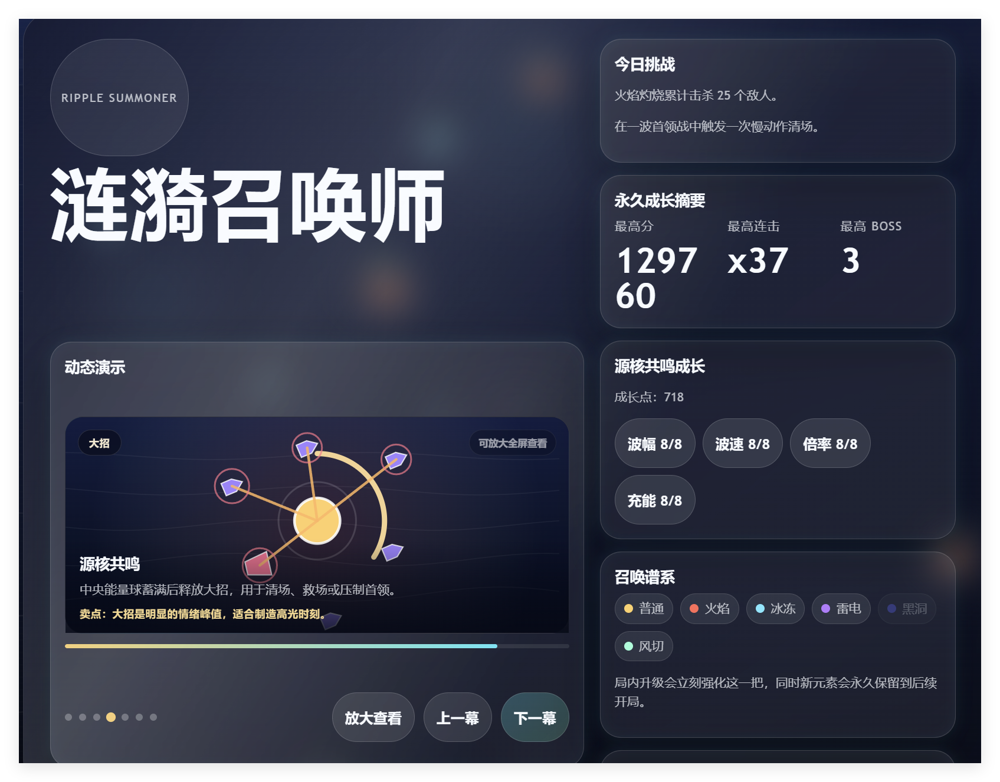
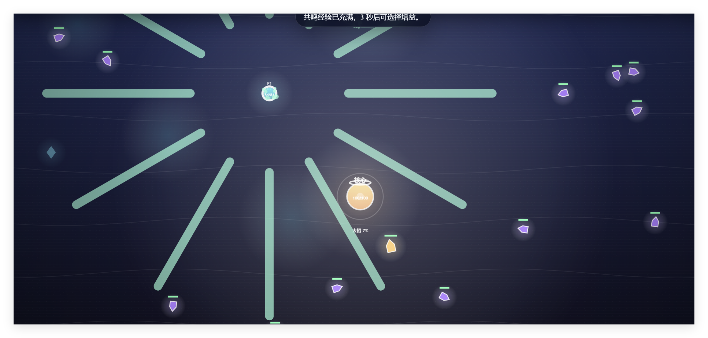
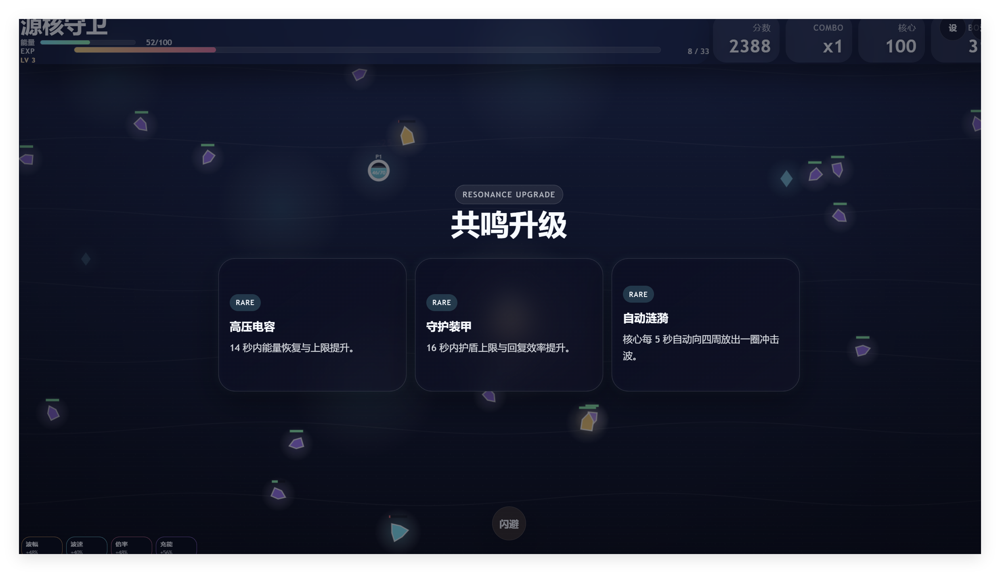
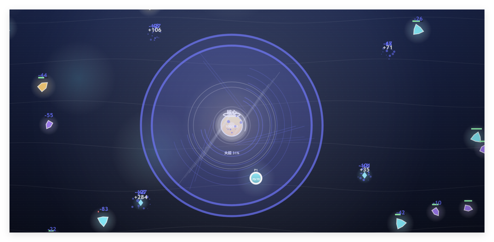
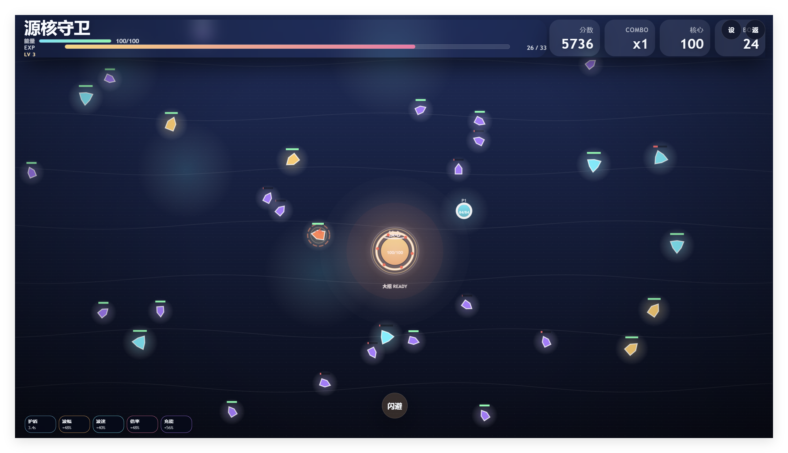
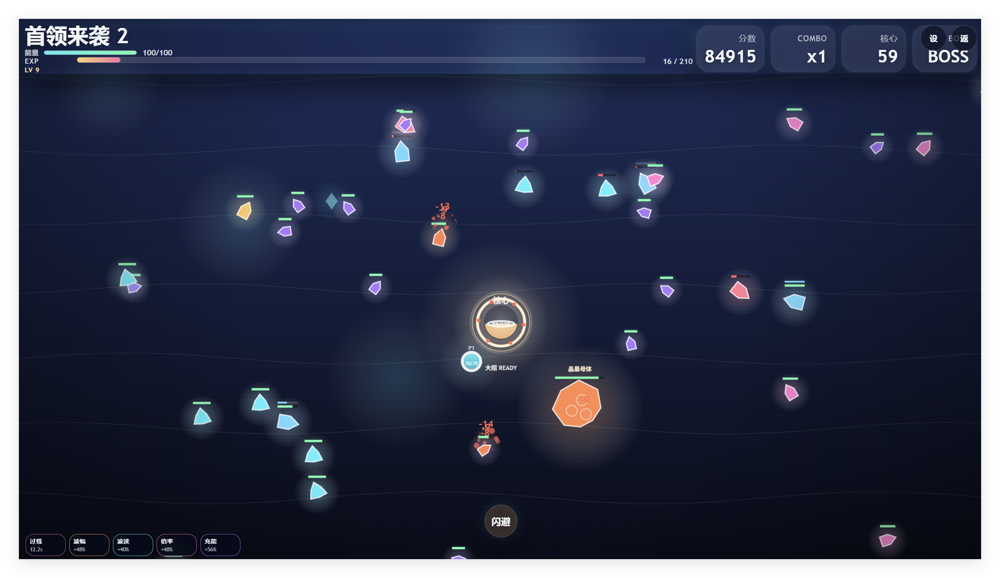
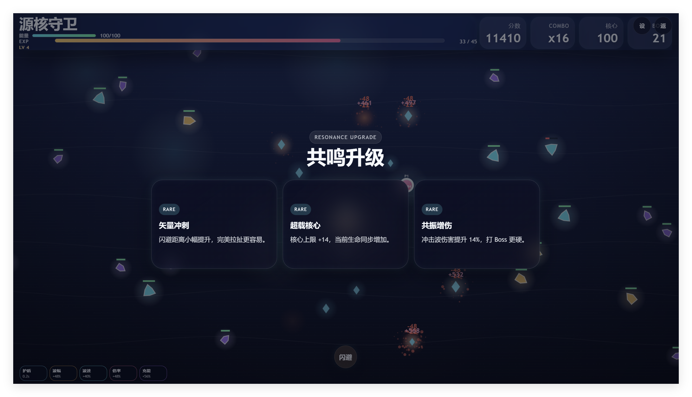
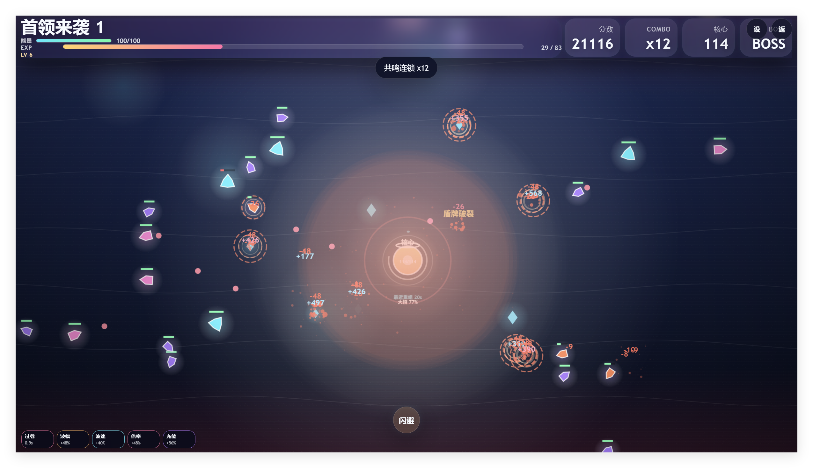

# Ripple Summoner / 涟漪召唤师

一个基于浏览器运行的俯视角生存动作游戏 Demo。

玩家需要守住最后的源核，在不断袭来的晶潮中点击、拖动、闪避，并使用火焰、冰冻、雷电、黑洞、风切等元素涟漪击退敌人与 Boss。项目同时支持本地双人协作，以及通过局域网中继进行双人联机。

## 项目特点

- 纯前端单页实现，直接打开 `index.html` 即可体验核心玩法
- 五种元素流派可选：普通、火焰、冰冻、雷电、黑洞、风切
- 点击点杀、拖动扫线、闪避位移、大招爆发，操作简单但节奏完整
- 支持单人模式、同屏双人协作、局域网双人联机
- 每 60 秒出现一次首领战，失败后保留部分成长用于下一局
- 自带音效资源与首页动态演示

## 玩法说明

- 目标：守住源核，尽量活过更多波次并击败首领
- 攻击：点击目标位置释放一次元素涟漪
- 清群：按住并拖动可持续扫出攻击轨迹
- 闪避：双击、右键或点击界面中的“闪避”按钮快速位移
- 大招：能量蓄满后释放终极技能，适合解围或处理 Boss
- 成长：局内会触发升级三选一，局外保留部分成长进度

## 操作方式

### 单人 / 主玩家

- 鼠标点击：定点攻击
- 鼠标拖动：持续攻击
- 双击 / 右键 / 闪避按钮：闪避位移
- 点击核心附近的大招球：释放终极技能

### 本地双人

- `W` `A` `S` `D`：移动 P2
- `F`：持续攻击
- `G`：闪避
- `R`：终极技能

## 快速开始

### 直接运行

这是一个前端页面项目，最简单的方式是直接打开根目录下的 `index.html`。

也可以使用任意静态服务器打开项目目录，例如：

```bash
npx serve .
```

## 局域网联机

项目内置了一个简单的局域网中继服务，位于 `server/host.js`。

### 1. 安装依赖

```bash
npm install
```

### 2. 启动中继服务

```bash
npm run lan:host
```

默认端口为 `8787`。

### 3. 打开游戏页面

房主页面示例：

```text
index.html?lan=ws://192.168.1.10:8787&role=host&room=hackathon-room
```

客户端页面示例：

```text
index.html?lan=ws://192.168.1.10:8787&role=client&room=hackathon-room&player=p2
```

如果需要优先走 HTTP 轮询通道，可以附加：

```text
&transport=http
```

## 目录结构

```text
.
├─ index.html              # 游戏主页面与主要逻辑
├─ server/
│  └─ host.js              # 局域网联机中继服务
├─ 游戏截图/              # README 展示用游戏截图
├─ 黑客松音效包/          # 游戏音效资源
└─ package.json            # Node 脚本与服务依赖
```

## 游戏截图

下面是当前仓库中的实机截图：










## 技术说明

- 前端：原生 HTML + CSS + JavaScript
- 联机服务：Node.js + `ws`
- 运行平台：现代桌面浏览器

## 备注

- 如果只是试玩单机内容，不启动 Node 服务也可以
- 若要演示联机，建议两台设备处于同一局域网，并使用房主机器的局域网 IP
